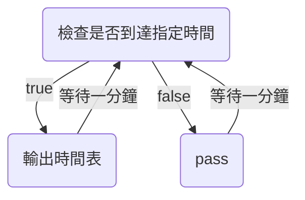
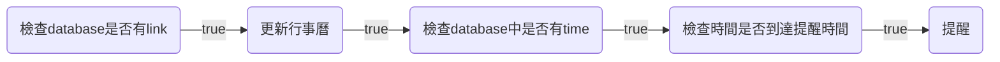

# User story

- [/help](https://hackmd.io/@MoonJam/BJBWyjvOC/%2F3r2RkG8FSdmuoaKk62ZkKg#help)
- [/weather](https://hackmd.io/@MoonJam/BJBWyjvOC/%2F3r2RkG8FSdmuoaKk62ZkKg#weather)
- [/set_calendar [username]](https://hackmd.io/@MoonJam/BJBWyjvOC/%2F3r2RkG8FSdmuoaKk62ZkKg#set_calendar_link-url)
- [/calendar_today](https://hackmd.io/@MoonJam/BJBWyjvOC/%2F3r2RkG8FSdmuoaKk62ZkKg#calendar_today)
- [/set_calendar_notify [time] (24hr)](https://hackmd.io/@MoonJam/BJBWyjvOC/%2F3r2RkG8FSdmuoaKk62ZkKg#set_calendar_notify_time-time)
- [/picture [要生成的字幕] (option, default:根據時間用llm生成)](https://hackmd.io/@MoonJam/BJBWyjvOC/%2F3r2RkG8FSdmuoaKk62ZkKg#picture-%E8%A6%81%E7%94%9F%E6%88%90%E7%9A%84%E5%AD%97%E5%B9%95-option-default%E6%A0%B9%E6%93%9A%E6%99%82%E9%96%93%E7%94%A8llm%E7%94%9F%E6%88%90)

## /help

```plaintext
blablabla
blablabla
blablabla
blablabla
blablabla
```

## /weather

### Sequence diagram

```mermaid
sequenceDiagram
    participant User
    participant @lazy_day_bot

    User->>@lazy_day_bot: /weather
    @lazy_day_bot-->>User: 詢問User位置(縣市)
    User->>@lazy_day_bot: 輸入縣市(顯示選單)
    @lazy_day_bot-->>User: 找到目的地附近站點
    User->>@lazy_day_bot: 輸入區(顯示選單)
    @lazy_day_bot-->>User: 早中晚的氣溫、降雨、風、紫外線、空氣品質、注意事項(帶傘)
```

### Reply Template

```plaintext reply_template
降雨機率：
早上(6 am)：{6 am 降雨機率}
中午(12 am)：{12 am 降雨機率}
晚上(6 pm)：{6 pm 降雨機率}


早中晚氣溫
早上(6 am)：{6 am temp}
中午(12 am)：{12 am temp}
晚上(6 pm)：{6 pm temp}

紫外線強度：{紫外線強度}
早上(6 am)：{6 am 紫外線強度}
中午(12 am)：{12 am 紫外線強度}
晚上(6 pm)：{6 pm 紫外線強度}

空氣品質指標（綠，橘，黃，紅）{綠，（空氣品質）}
```

## /set_calendar_link [link]

### Sequence diagram

```mermaid
sequenceDiagram
    participant User
    participant @lazy_day_bot
    participant database

    User->>@lazy_day_bot: /set_calendar_link [link]
    @lazy_day_bot->>database: 儲存 calendar_username 
    @lazy_day_bot-->>User: 儲存成功！
```

### Reply Template

```plaintext reply_template
Calendar link {url} save successfully
```

## /calendar_today

### Sequence diagram

```mermaid
sequenceDiagram
    participant User
    participant @lazy_day_bot
    participant google calendar

    User->>@lazy_day_bot: /calendar_today
    @lazy_day_bot->>google calendar: 給我今天的行事曆！！！ 
    google calendar-->>@lazy_day_bot: 這是你今天的行事曆！！！ 
    @lazy_day_bot-->>User: 時間表
```

### Reply Template

```plaintext reply_template
TIME TODO

TIME TODO

TIME TODO

...
```

## /set_calendar_notify [time] (24hr)

### Sequence diagram

```mermaid
sequenceDiagram
    participant User
    participant @lazy_day_bot
    participant database

    User->>@lazy_day_bot: /set_calendar_notify [time]
    @lazy_day_bot->>database: 儲存 calendar_notify_time
    @lazy_day_bot-->>User: 儲存成功！
```

### Reply Template

```plaintext reply_template
Calendar link {url} save successfully
```

## notify on time



## update_calendar



## /picture [要生成的字幕] (option, default:根據時間用llm生成)

### 有輸入生成字幕

```mermaid
sequenceDiagram
    participant User
    participant @lazy_day_bot
    participant database

    User->>@lazy_day_bot: /picture [要生成的字幕]
    @lazy_day_bot->>database: 隨機取得一張圖片
    database-->> @lazy_day_bot: 在圖上放字
    @lazy_day_bot -->> User: 把圖輸出
```

### 沒有輸入生成字幕

```mermaid
sequenceDiagram
    participant User
    participant @lazy_day_bot
    participant Gemini
    participant database

    User->>@lazy_day_bot: /picture
    @lazy_day_bot->>Gemini: 依照目前時間生成早安午安晚安文案
    Gemini->>database: 隨機取得一張圖片
    database-->> Gemini: 回傳圖片
    Gemini-->> @lazy_day_bot: 在圖上放字
    @lazy_day_bot -->> User: 把圖輸出
```

### Reply Template

```plaintext reply_template
image
```

## [location]

```mermaid
sequenceDiagram
    participant User
    participant @lazy_day_bot
    participant Gemini

    User->>@lazy_day_bot: send [location]
    @lazy_day_bot->>Gemini: 將經緯度轉換成地址並要求生成行程
    Gemini-->> @lazy_day_bot: 生成行程
    @lazy_day_bot -->> User: 輸出行程
```
