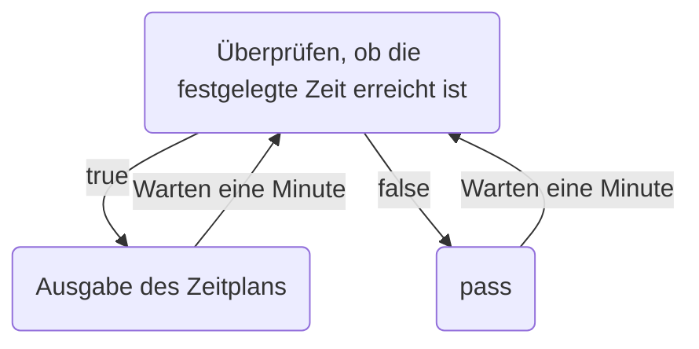

# Benutzerstory

- [/help](https://hackmd.io/@MoonJam/BJBWyjvOC/%2F3r2RkG8FSdmuoaKk62ZkKg#help)
- [/weather](https://hackmd.io/@MoonJam/BJBWyjvOC/%2F3r2RkG8FSdmuoaKk62ZkKg#weather)
- [/set_calendar_link [link]](https://hackmd.io/@MoonJam/BJBWyjvOC/%2F3r2RkG8FSdmuoaKk62ZkKg#set_calendar_link-url)
- [/calendar_today](https://hackmd.io/@MoonJam/BJBWyjvOC/%2F3r2RkG8FSdmuoaKk62ZkKg#calendar_today)
- [/set_calendar_notify_time [time] (24hr)](https://hackmd.io/@MoonJam/BJBWyjvOC/%2F3r2RkG8FSdmuoaKk62ZkKg#set_calendar_notify_time-time)
- [/picture [zu generierender Text] (Option, Standard: basierend auf der Zeit mit LLM generieren)](https://hackmd.io/@MoonJam/BJBWyjvOC/%2F3r2RkG8FSdmuoaKk62ZkKg#picture-zu-generierender-Text-Option-Standard-basierend-auf-der-Zeit-mit-LLM-generieren)

## /help

```plaintext
blablabla
blablabla
blablabla
blablabla
blablabla
```

## /weather

### Sequenzdiagramm

```mermaid
sequenceDiagram
    participant User
    participant @lazy_day_bot

    User->>@lazy_day_bot: /weather
    @lazy_day_bot-->>User: Frage nach Benutzerstandort (Stadt oder Landkreis)
    User->>@lazy_day_bot: Eingabe der Stadt/des Landkreises (Anzeigemenü)
    @lazy_day_bot-->>User: Finden der nächstgelegenen Station
    User->>@lazy_day_bot: Eingabe des Bezirks (Anzeigemenü)
    @lazy_day_bot-->>User: Wetterdaten für Morgen, Mittag und Abend: Temperatur, Regenwahrscheinlichkeit, Wind, UV-Index, Luftqualität, Hinweise (Regenschirm mitnehmen)
```

### Antwortvorlage

```plaintext reply_template
Regenwahrscheinlichkeit:
Morgens (6 Uhr): {6 Uhr Regenwahrscheinlichkeit}
Mittags (12 Uhr): {12 Uhr Regenwahrscheinlichkeit}
Abends (18 Uhr): {18 Uhr Regenwahrscheinlichkeit}

Temperatur für Morgen, Mittag und Abend:
Morgens (6 Uhr): {6 Uhr Temperatur}
Mittags (12 Uhr): {12 Uhr Temperatur}
Abends (18 Uhr): {18 Uhr Temperatur}

UV-Index: {UV-Index}
Morgens (6 Uhr): {6 Uhr UV-Index}
Mittags (12 Uhr): {12 Uhr UV-Index}
Abends (18 Uhr): {18 Uhr UV-Index}

Luftqualitätsindex (grün, orange, gelb, rot): {grün, (Luftqualität)}
```

## /set_calendar_link [link]

### Sequenzdiagramm

```mermaid
sequenceDiagram
    participant User
    participant @lazy_day_bot
    participant database

    User->>@lazy_day_bot: /set_calendar_link [url]
    @lazy_day_bot->>database: Speichern des calendar_link
    @lazy_day_bot-->>User: Erfolgreich gespeichert!
```

### Antwortvorlage

```plaintext reply_template
Kalenderlink {url} erfolgreich gespeichert
```

## /calendar_today

### Sequenzdiagramm

```mermaid
sequenceDiagram
    participant User
    participant @lazy_day_bot
    participant google calendar

    User->>@lazy_day_bot: /calendar_today
    @lazy_day_bot->>google calendar: Gib mir den heutigen Kalender!
    google calendar-->>@lazy_day_bot: Hier ist dein heutiger Kalender!
    @lazy_day_bot-->>User: Zeitplan
```

### Antwortvorlage

```plaintext reply_template
ZEIT AUFGABE

ZEIT AUFGABE

ZEIT AUFGABE

...
```

## /set_calendar_notify_time [time] (24hr)

### Sequenzdiagramm

```mermaid
sequenceDiagram
    participant User
    participant @lazy_day_bot
    participant database

    User->>@lazy_day_bot: /set_calendar_notify_time [time]
    @lazy_day_bot->>database: Speichern der calendar_notify_time
    @lazy_day_bot-->>User: Erfolgreich gespeichert!
```

### Antwortvorlage

```plaintext reply_template
Kalenderlink {url} erfolgreich gespeichert
```

## Benachrichtigung zur festgelegten Zeit



## /picture [zu generierender Text] (Option, Standard: basierend auf der Zeit mit LLM generieren)

### Eingabe des zu generierenden Textes

```mermaid
sequenceDiagram
    participant User
    participant @lazy_day_bot
    participant database

    User->>@lazy_day_bot: /picture [zu generierender Text]
    @lazy_day_bot->>database: Zufälliges Bild abrufen
    database-->> @lazy_day_bot: Text auf Bild platzieren
    @lazy_day_bot -->> User: Bild ausgeben
```

### Keine Eingabe des zu generierenden Textes

```mermaid
sequenceDiagram
    participant User
    participant @lazy_day_bot
    participant Gemini
    participant database

    User->>@lazy_day_bot: /picture
    @lazy_day_bot->>Gemini: Erstellen eines Textes basierend auf der aktuellen Zeit (Guten Morgen, Guten Tag, Guten Abend)
    Gemini->>database: Zufälliges Bild abrufen
    database-->> Gemini: Bild zurückgeben
    Gemini-->> @lazy_day_bot: Text auf Bild platzieren
    @lazy_day_bot -->> User: Bild ausgeben
```

### Antwortvorlage

```plaintext reply_template
Bild
```